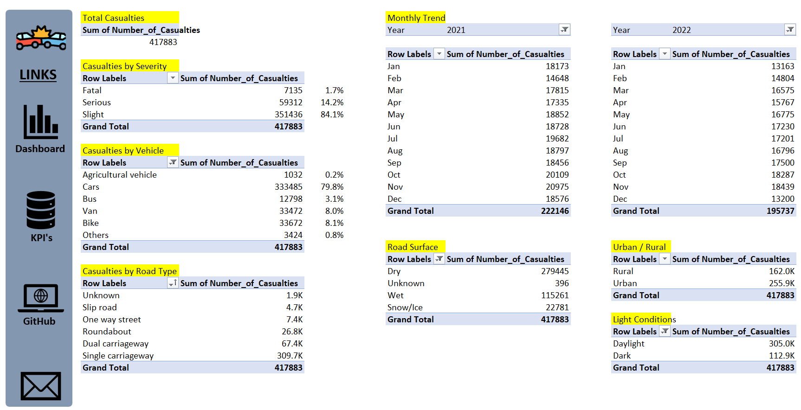

### Data Preparation / Cleaning
* Data loading and inspection
* Handling missing values and incorrect data
* Properly formatting data

---

### Exploratory Data Analysis
* EDA involved exploring the accidents data to answer key questions such as:
    * Total Casualties
    * Total Casualties & Percentage with respect to:
        * Accident severity
        * Vehicle type
    * Total Casualties with respect to vehicle type
    * Monthly trend comparing casualties for current and previous year
    * Casualties by road type
    * Total casualties by road surface
    * Relation between casualties by area / location & day/night

---

### Data Analysis
## KPI

## Dashboard

## EDA Results
* Total Casualties
|Total Casualties|
|---|
|417883|

* Total Casualties & Percentage with respect to:
    * Accident severity
    * Vehicle type
* Total Casualties with respect to vehicle type
* Monthly trend comparing casualties for current and previous year
* Casualties by road type
* Total casualties by road surface
* Relation between casualties by area / location & day/night